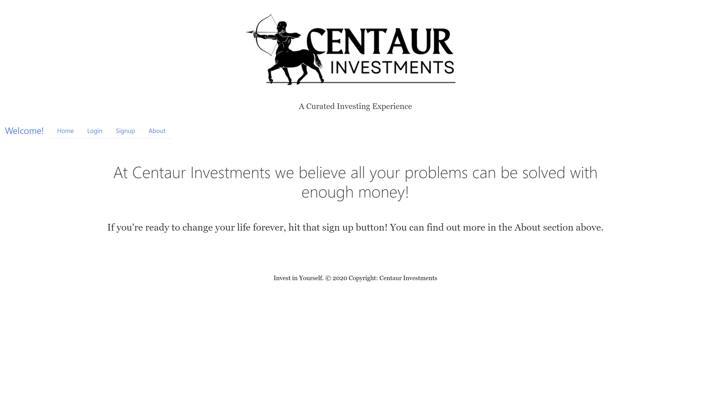
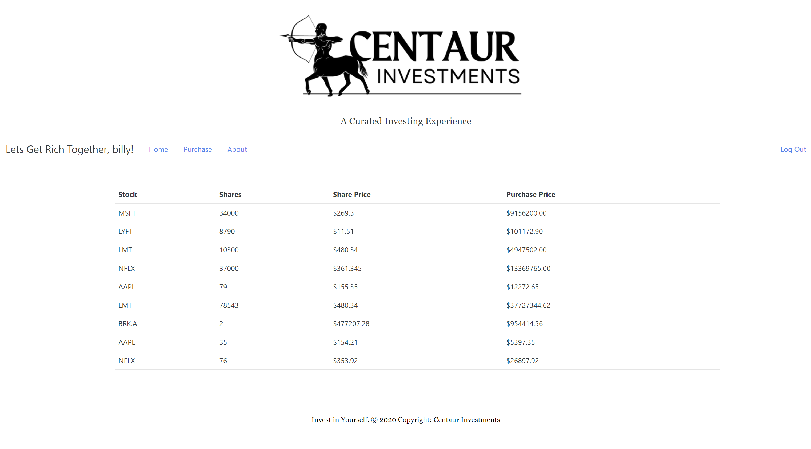
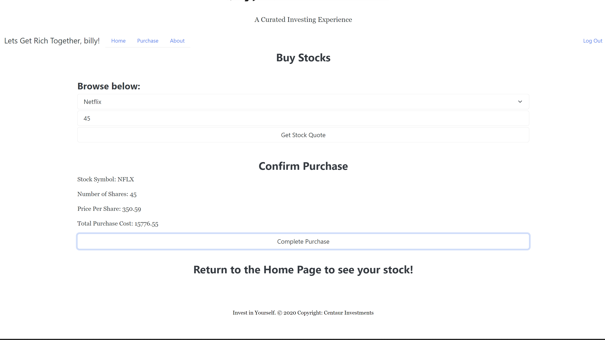

# Centaur Investments

Link to Deployed Application: [https://mysterious-gorge-28306.herokuapp.com](https://mysterious-gorge-28306.herokuapp.com)

## Table of Contents
- [Technologies Used](#technologies-used)
- [Description](#description)
- [Visuals](#visuals)

## Technologies Used
MongoDB, REACT, EXPRESS, NODE, Apollo

## Description
This is an investment app that allows users to communicate with Alpaca API and get current prices on their favorite stocks. They can pick a stock and choose how many shares they would like, and once they submit the request they are brought back a confirmation of what they chose, and the total amount of money it would cost to purchase those stocks. It uses Apollo to communicate to the MongoDB and Apollo Client to get that data back to the client side. The front end is built with React.

Visuals

